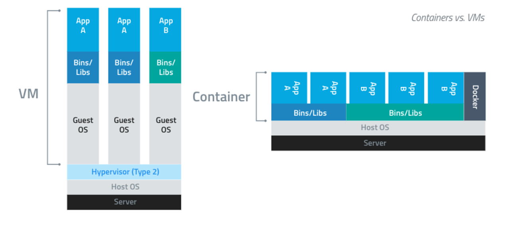
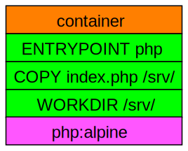

 <!-- .element style="border: none; box-shadow:none;" -->

Notes:
This is a basic introduction to docker.   I'll be delving into a few areas that
I find particularly useful and sharing some methods that I've found useful in
the past.

---

## So what is it?

 <!-- .element class="fragment fade-in" style="border: none; box-shadow:none;" -->

Notes:
Docker in abstract is analogous to worldwide shipping, before the use of standardised containers
shipping required lots of faffing about loading and unloading.  But with the advent of a
standard shipping container it became so much easier as the shipping agent didn't need to care
much about the contents of the container, only that they could handle the standard container.

In our world, deploying software is an onorous task especially with many layers of dependencies.
But when using docker containers, the host only needs to run the docker engine and can then handle
running any container.  The software you want to deploy then just needs to be packaged up into
a container along with all its dependencies.

This sounds a bit like a VM, and it is - but unlike a VM, the container does not contain
a full guest OS kernel - it relies on the linux kernel of the host (hence why docker on windows
and mac run a special VM to execute the docker containers), and hence is able to spin up
in seconds.  Libraries are internal to the container though, which is useful if you have couple
of pieces of software with conflicting library needs.

---

## Containers and Images

<pre class="fragment fade-in"><code class="lang-bash hljs" style="font-size:17px;">$ docker run hello-world

Hello from Docker!
This message shows that your installation appears to be working correctly.

...

$ 
</code></pre>

Notes:
A container is launched by running an image.
An image is an executable package that includes everything needed to run an application–the code,
a runtime, libraries, environment variables, and configuration files.

A container is a runtime instance of an image–what the image becomes in memory when executed
(that is, an image with state, or a user process).

So how do we make a container?  First we take an image, which is a template for the container
a snapshot of the contents - like a manifest.   A container itself is the combination of the
image, and the interface between it and the outside world.  What ports are open?  Is there any
storage mounted?  What network is it attached to?  What name does this instance have?

An example: docker run hello-world
Docker engine - fetches the latest hello-world image from the registry - unless it has it already.
Executes that image.

Within the container - entrypoint process run as PID 1, root user (unless otherwise specified)

---

## Building your own image

<pre class="fragment fade-in"><code class="lang-bash" style="font-size:17px;">cat &lt;&lt;EOF &gt;Dockerfile
FROM alpine
ENTRYPOINT ["echo", "hello"]
CMD ["world"]
EOF

docker build -t echo-hello-world .
</code></pre>

Notes:
Each step in building a container creates a new transitional image, future builds will reuse that layer if
it is unchanged.  Hence keep the frequently changing parts of your image near the end of your dockerfile
and you won't have to do those slow steps so frequently.

Go build example1... (it's PHP, but only because that's an easier example than java)
Container inspection, env vars, security

---

## Layers

 <!-- .element style="border: none; box-shadow:none;" -->

Notes:
AUFS and layers - so keep the layers small, don't leave temporary files lying about

Base images:
Every image is built on top of the layers of another image, so where should we start from?

scratch (build from nothing!) - this is a special "start from scratch" - sometimes used for image with
statically linked binaries (common golang pattern)
alpine linux (minimal, built for docker, not glibc!), distroless (exceptionally minimal, even ls/cat etc.. not present)
ubuntu/debian/centos all pretty big images - but if you need glibc....

Other trusted images in hub.docker.com (or artifactory)

---

## Volumes

Notes:

The filesystem of a docker container is a temporary thing - when the container goes away (is deleted, not stopped),
so does that filesystem.
But this isn't great for a container running a database, or anything else requiring persistent storage.

So: docker has the concept of volumes - these persist beyond the lifetime of the container, and can be mounted by
a new container.

This mechanism can also be used to share storage between two containers, even if it's not needed for persistent storage.
(Volumes_from)

Alternatively, a directory on the host can be mounted by the container.  Always be careful here, files written by the
container on a mounted directory with have uids and privileges from the container config, so it's often the case
that they'll be root owned (UID=1)
Individual files can be mounted - but beware of inodes.  The inode is mounted, so if your editor writes a new copy of
the file and replaces it on the host FS, the container will still see the original version.

Not cleaning up volumes can be a quick way to run out of storage in your docker engine.

Use tmpfs as an in mem mount - various bits of /proc, /dev and /sys/fs/cgroup are all mounts expected to be tmpfs

---

## Network

* Linux network stack
* Additions by docker

Notes:
Docker provides networking to the containers via a special interface on the host (docker0, often the 172.17.0.0/16 network)
Basically NAT, operating on virtual interfaces like a VPN does

Named networks can allow several docker container to communicate privately.  Peer containers must expose ports.

Container can specifically be linked (--link), though this is deprecated

Exposing ports and binding ports

Extra hosts - adds entries to hosts file

Managed hosts file and resolve.conf

---

## So what base images are there?

https://hub.docker.com

artifactory.dataengineering.apps.hmrci:8001/dedgbase/dedg-selinux <!-- .element class="fragment" -->

Notes:
Beware - anyone can publish images: look for official, certified, verified publisher

Useful images: redis-cli, jdk, 

---

## Dockerfile tips

* ENTRYPOINT vs CMD <!-- .element class="fragment" -->
* ADD vs COPY <!-- .element class="fragment" -->
* Most stable steps first <!-- .element class="fragment" -->
* Install and cleanup <!-- .element class="fragment" -->
* Multi-stage dockerfiles <!-- .element class="fragment" -->

Notes:
Entrypoint not overridden by command line arguments, CMD is - see earlier hello-world example
Add can fetch from URLs, and will automatically extract tarballs.  Use COPY unless you need these features

Dockerfile
FROM something AS base
RUN Install common dependencies needed by build, test and runtime

FROM base AS build
RUN Perform build/compilation steps

FROM build AS test
RUN Installation of test dependencies and run tests

FROM base AS release
COPY built artifacts from build image
ENTRYPOINT blah

---

## Docker inside docker

<pre class="fragment fade-in"><code class="lang-bash hljs" style="font-size:17px;"># Mount docker socket
docker run -it -v /var/run/docker.sock:/var/run/docker.sock alpine sh
apk update; apk add docker
docker ps -a
</code></pre>

Notes:
There are few reasons to run docker inside a container, and most of those involve developing the docker engine.
However, there are plenty of situations where you want to use docker but you are inside a docker environment.
E.g. Jenkins slaves running as docker containers, ansible run on molecule docker container

So what do we do?  Mount the docker socket

Sometimes the docker socket mount is a pain (when /var/run is tmpfs, the mounted socket cannot be seen)
Just mount it somewhere else and set DOCKER_HOST env to unix://ABSOLUTEPATH

---

## Useful commands

<pre class="fragment fade-in"><code class="lang-bash hljs" style="font-size:17px;"># Run a command inside a running container
docker exec -it CONTAINER COMMAND
</code></pre>
<pre class="fragment fade-in"><code class="lang-bash hljs" style="font-size:17px;"># Run a container but change the entrypoint
docker run -it --entrypoint COMMAND IMAGE
</code></pre>
<pre class="fragment fade-in"><code class="lang-bash hljs" style="font-size:17px;"># Clean up unused items
docker container|volume|image prune
</code></pre>

---

## Advanced

Debugging a difficult container

Notes:
Distroless or scratch based containers (go binaries for example) can be hard to debug - there's no shell
to use in exec or run 
https://medium.com/@rothgar/how-to-debug-a-running-docker-container-from-a-separate-container-983f11740dc6
FROM alpine
RUN apk update && apk add strace bash
ENTRYPOINT "/bin/bash"

docker run -t --pid=container:TARGET \
  --net=container:TARGET \
  --cap-add sys_admin \
  --cap-add sys_ptrace \
  strace

Filesystem NOT the same as original container - to get at the files look at /proc/1/root/

---

## Other bits and pieces

Notes:
Docker storage - specifics for the platform VM
Privilege and capabilities - security and breaking out!
Responding properly to signals and zombie processes (tini is a quick solution)
Proper guest OS - rstudio + sssd + init

OCI (Open Container Interface) & Atomic
docker swarm - orchestration

