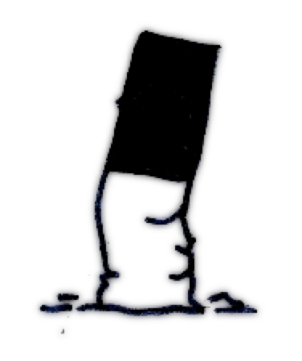

# What not to do
## A guided tour of unit testing

---

## Colin Ameigh
### About me
Notes:
Some speaker notes

---

# Pyramid

Note:
  So we’re all familiar with the test pyramid.
  
  A broad base of unit tests, supporting a handful of integration tests, supporting a few full system tests.
  What everyone sees is the shiny exterior of this pyramid, giving them confidence in the product.
  
  The reality is that the unit tests, the foundation of the pyramid, are often rotten – held together by spit and twigs and manual interventions.
  
  Sometimes it seems best just to burn the whole lot and start again.
  
  So lets look at unit testing, I find it best to view things through counterexamples.

---
<!-- .slide: id="example" -->

!include(example1.php lang=php)
Notes:
Counterexample - this is not a unit test.

It appears to be part way between a system test and integration test - tying most elements of the system together in the “dispatch” method.

a) use of a loader to set up a database… so the database needs to exist and be running on the environment the test is running in
b) contents of the database can be changed by config changes
c) our desired test behaviour is overriding some kinds of database lookup anyway 

---
<!-- .slide: id="atomic" -->

!include(atomic.php lang=php)

Notes:
Atomic - runs alone without needing other tests to run before or after.
   Excessively simplified to prove the point - the testMultiplyValue will fail if run alone, unless the class actually has “15” as a default value, in which case the first test is useless.

---
<!-- .slide: id="trust" -->

!include(trustworthy.php lang=php)
Notes:
Trustworthy - runs anywhere - dev machine, docker container, CI flow.
   Should not depend on external processes, particular paths etc.. setting up all the dependencies itself.
      This example seems straightforward, but will fail if the timezone is ‘America/Los_Angeles’ for example.

---
<!-- .slide: id="readable" -->

!include(readable.php lang=php)
Notes:
Maintainable - code quality should equal or exceed production code.
Readable - can you work it out just by reading.
   This example fails on both fronts, with mixed tabs and spaces, inconsistent indents, poor variable naming, spelling issues and bad test names (to be fair to the author of the test I used as an example here, the formatting, variable names and spelling I’ve deliberately made much worse, but the original isn’t still hard to understand)

---
<!-- .slide: id="bad" -->

!include(badstructure.php lang=php)
Notes:
First a badly structured test - this is a bit of a mess and when split over several files can be hard to determine what is going on

We’ll skim over the fact that this is not a unit test either

---
<!-- .slide: id="good" -->

!include(goodstructure.php lang=php)
Notes:
Next, something much clearer:
If you can clearly break your test up into these sections it will be more readable.
1,2 setup
3 execute
4 verify
5,6 teardown
It seems obvious, but some of this often gets mixed up - and is not always clear.

In the spirit of leaving things better than we found them - lets go back to that badly structured test and improve it.

---
<!-- .slide: id="imp" -->

!include(impstructure.php lang=php)
Notes:
So login is now called in setup, and will not fail the test if it fails, but skip it.

Verify sometimes gets mixed in with setup when using mocks… so lets talk a bit about mocks

---

!include(dummy.php lang=php)
Notes:
You may have heard of Mocks, Stubs and Spies.

Specifying what is returned:
  Dummies - don’t care whether they are called, always return null.

---

!include(stub.php lang=php)
Notes:
 Stubs - don’t care what they are called with, or how many times, always return fixed value.

---

!include(fake.php lang=php)
Notes:
Fake - don’t care how many times they are called, have simple logic to map arguments -> return value

---

Notes:
What if we need to know how it was called:
  Spy - counts invocations and arguments (PHPUnit easy spies with $spy=$this->any())  (Spies can be dummy spies, stub spies or fake spies)

Mocks can be used to describe all of these, but often they exert also assertions over how they are called - spies with assertions built in (I prefer spies)  This can be useful as shorthand in tests.

---

!include(testconstructor.php lang=php)

Notes:
There are lots of examples that I’ve discovered in my time.

Let’s describe some basic ones:

Test that the constructor works, but with no assertion… this just tests that a constructor fails to throw an exception… probably useless - particularly if you write good constructors.

---

!include(testreturntype.php lang=php)

Notes:
Tests that a function{ return “foo” } has a string type on its return… also probably useless.  Tests for testing sake.  (A danger of TDD - it’s possible that this could be tested with a broader test)

---

!include(testhiddendep.php lang=php)

Notes:
Tests that rely on files in the filesystem

---

!include(bewaremockery.php lang=php)

Notes:
Mockery 
Gives false impression that all those shouldReceive()->with() calls are assertions
Even when they are assertions, will give an error (and stacktrace) in the test teardown, not in the test method
What even is meant to be being tested here? Anyone?

Mockery - reads better than the equivalent PHPunit mock, but acts oddly

---

# Q?
